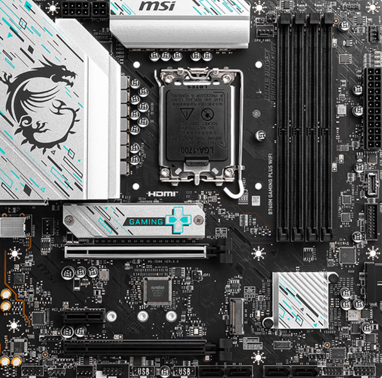

家里的电脑2006年配的，之前用的i5 2300，主板坏了就买个二手主板继续用，办公什么的都没问题。上次按垃圾佬配方配RX580电脑的时候觉得好便宜，就家里又买了块RX580显卡，升级了BIOS，能跑，用的不多，后面再开就不会亮了，二手580坏了。拆了继续用集显用了段时间，去年逛咸鱼发现一家修显卡的店，跟卖家聊了下说是90，那可以啊，我当时买的显卡200多，去年看的时候好像已经四五百了，那修下划算的。好像就两天，显卡修好回来了，现在用在办公室电脑上，很不错。去年还第一次做的事情就是寄修鼠标，之前坏了都是扔的，G703当时买的时候600左右，舍不得扔，也是寄修修好了，挺好。

办公室的RX580拿回家用，网上查了说是i5 2300太差了，想着自己前面淘的迷你主机买了i3-9100T可以换，就去买了个华硕PRIME B365M-K主板200元，这主板神奇的很，还支持E3V5，i3就不拆了，我另外买了E3-1270V5，挺好，内存插了16G，可以了，本来想就这么用用好了。

有天看了[钛师父的公号](https://mp.weixin.qq.com/s/xp_e_090pZ9BWxBRrNSlSg)说RX 9060 XT性价比很高，就去京东逛了下，结果还真给我找到了，500块的9060XT 16G全新的，一开始不敢买，最后想想500真没了就没了，万一买到真的呢，等我付好钱再看，这款显卡就缺货了。结果呢，也算预料之中，没发货，咨询客服回复就是缺货，算了，我申请了退款。

显卡没买成，这草却种下了。问了下deepseek玩魔兽和赛博朋克2077，500w电源，升级什么显卡合适，结果推荐了3060Ti，淘宝看了下1500左右，行吧，来一块。买了华硕 RTX3060Ti 8G 巨齿鲨，装平头哥机箱怼着风扇，刚刚能装下。玩了下第一后裔，显卡20%，CPU100%。网上查了下说是CPU瓶颈，那要么再换个CPU。

换CPU这个就纠结了，现在硬盘内存疯涨，选哪个呢，最早我是想配R5 5600的，然后就看到5700X，好像也差不多，要么DDR5的，7500F，还是9600X。唉，还是内存太贵，32G近4000了。就因为这个内存，最后我挑来挑去挑了i5 12400F，下单CPU套装的时候发现还是12490F套装便宜，就买了B760M GAMING PLUS WIFI D4 + i5 12490F，买好了才知道12490F盒装也没风扇的，好在上次换E3的时候买的乔思伯查了下还能压得住，也就不另外买了。

第二天就到货了，装机折腾了一个晚上，实在是平头哥的机箱小了点，主板放进去刚刚好，拧螺丝什么的很不方便，然后又把电源线插错位置，以为是电源坏了，换来换去都不亮再去查公号才知道是插错了。买这个主板是看中了有四条内存插槽，家里还有台750Ti的小电脑上面还有两条8G，这次把四条都插上了，小电脑上还有个1T固态，也全部拆过来了。

现在的配置是：
- I5 12490F
- B760M GAMING PLUS WIFI D4
- 32G DDR4 2400
- RTX 3060Ti
- SSD 1.5T

就这样吧，反正没我想象的那么快，可能还是内存的频率原因吧。那么问题来了，下次升级，我CPU换不换，买这个U是看中DDR4 DDR5都兼容的，但如果下次直接不要了，那为什么要买这个U呢？哈哈哈，要么下次还是AMD平台吧！
