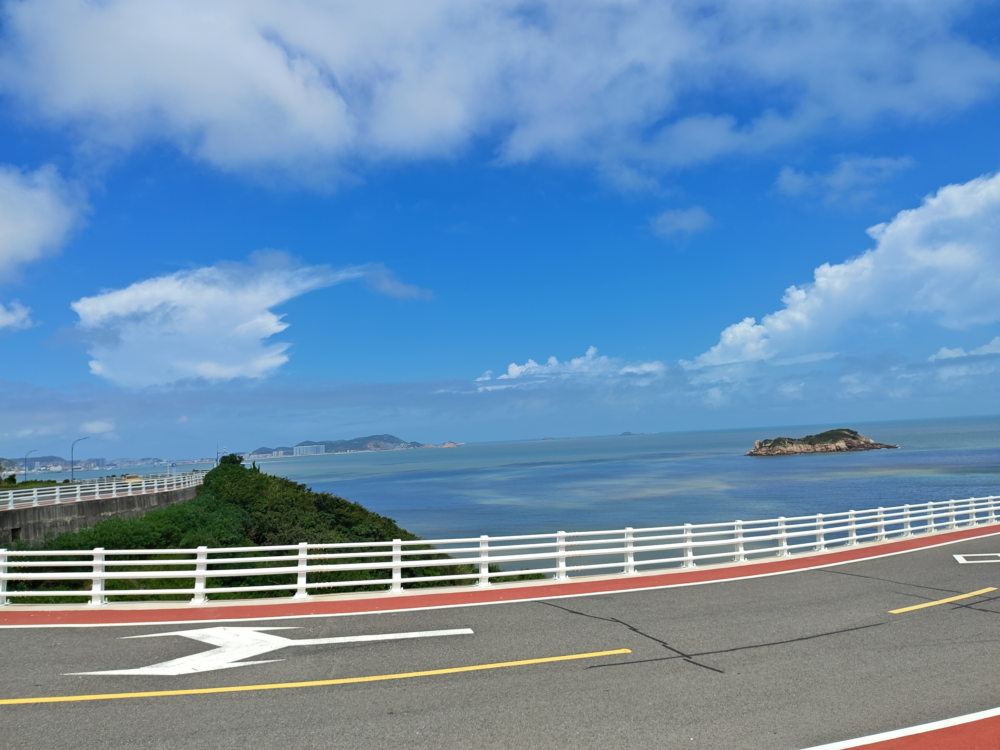

两年一次的疗休养，2019年千岛湖之后就再也没去了。没心情，没时间，宁可在家多呆几天。今年寒假带娃去了趟老家海边，到了那边就玩充气城堡，结果回来又说大海没玩好。那安排呗，疗休养第二年，今年再不去就又浪费了。海边的线路一条条比下来，舟山景点多点之前也去过了，石塘么离老家近可以自己去，嵊泗点很少，大部分时间就是自由活动，很好嘛，小孩也不会累，就报了8.17-8.21的那趟。

老家16号回的杭州，第二天早上就出发了，第一天就是去的路上，坐车去的上海沈家湾码头，再渡船去的嵊泗，娃是小社牛，一上船就交上朋友了，几个人一起打双扣，竟然也打的有模有样。一个最小的小孩打的最好，每次打完还会复盘，后来才知道他在学桥牌的。打完牌带娃在船舷吹海风，刚出来应该是有点害怕的，手紧紧抓着栏杆，眼睛眯起来，防晒衣被海风吹的鼓鼓的，问好不好玩说是好玩的。娃这次坐船表现不错，包括后面出海捕鱼，别的孩子后面有晕船的，她有时候也会说晕，一会儿就好了。

陆上来回两顿饭都是在汤记传菜吃的，菜不错，好看也好吃。岛上吃饭有排挡有民宿，就有个晚上的排挡感觉就真的是大排档，塑料盆子塑料碗，这家后来一顿投票的时候果断否了。食材挺新鲜，梭子蟹每顿都有，我印象里最好吃的那顿应该是出海捕鱼回来的那顿，饭店就是码头旁边的饭店，我们当时在二楼吃的。有露台，露台上还有覆着一层塑料茅草的卡座，很好看，好几个同事带小孩在那拍照打卡。

这次带娃出去是我洗衣服最勤快的一次，酒店也有阳台，就是阳台上的晾衣绳破破烂烂，我就担心衣服会被六楼大风吹跑，一直晾在房间里。回来就吃苦头了，这些衣服干的半干的都在洗衣机里重新洗了，洗出来还是臭的不行，网上查了下说是什么阴干菌，衣服阴干24小时没干这种细菌就会大量繁殖了，我后来加滴露重新洗了，然后又是另一种味道了。。。

酒店分房间的时候人多懒得抢，最后个房间给了我，3603，一进屋就一股樟脑薄荷味，第一反应就是这个房间应该刚装修，门锁的保护膜都还在，后来问了导游说是去年12月装的，也就没要求换房间了，以后还是要提点要求，太随和不好。

酒店跟沙滩还是有段路，走走大概十几分钟，导游当时带我们从边门进的沙滩，回来就找不到电动车租了。第二天导游说什么哈啰电瓶车跟酒店门口的租下午到晚上只要20，就去租了，结果讨价还价最后还是付了34.5。然后下午一起在沙滩玩的同事说他们从正门出去就可以租到美团和滴滴的电动车了，那个车十分钟内只要两块钱，马上感觉亏大了。后面就再也不租哈啰的大电瓶车了。

这次主要是娃要去海里玩，之前说不游泳就没带泳衣，完了到那边想想还是要用的，问前台哪里买他们建议我外卖，我竟然第一反应是大众点评，还可以，大概40多分钟就送到了。后面还用了一次淘宝闪购，买了两瓶AB胶，有个16块的红包，最后大概只用了6块钱就买了两支得力的AB胶和一包手套。

娃胆子小，只敢坐在沙子上让海浪冲冲，冲到后面就发现很多小鱼，然后就是疯狂抓小鱼，还借了小朋友的网，最后还是一条也没抓到。酒店里有个小店，想着去买网的，最后没网卖，买了个游泳圈回来，尺寸好像是60，花了24块钱。游泳圈第二天玩的还挺开心的，娃坐着我拖出去，再让浪推回来。后面再往外面拖的时候被救生员批评了，说再出去就回不来了，才想起之前看过的什么潮往上走，会有一道往下的洋流的，再也不敢拖出去了。

玩到后面最终又是借了网兜抓小鱼，还是一条小鱼也没，不过最后发现了一只小螃蟹，娃看到螃蟹用力一兜，兜了一大把沙子，我还以为这次又没希望了，然后就看到个螃蟹在网兜里游上来了。我赶紧去把矿泉水喝了给她装螃蟹，弄了点海沙和海水放瓶里，最后她说自己来转移，我就把瓶盖给她了。好像是装进瓶子了，可怎么找都找不到，娃就急了，瘪瘪嘴就要开始哭了。我把瓶子横过来转了几圈，螃蟹终于浮出来了，然后接下来的晚饭包括第二天出去玩她都带着这个螃蟹，当天晚上还去海滩专门装了半瓶海水说是以后给螃蟹换水。

螃蟹撑到第二天的中午，终于死透了，我说扔了吧，娃说要做标本，借了我手机开始网上查攻略怎么做标本，还一张张截图存相册。行吧，所以我才会去买了AB胶和手套。。。福尔马林岛上没有，酒精么防腐时间太长。后来就干脆没防腐，直接就糊AB胶了。因为防腐没做，回到家的第二天，娃跟我说螃蟹肚子烂了，水都流出来了，我本来以为能封住的，看来还是不行。

下午标本做完，到晚上就有小朋友又送了她一只螃蟹，说是赶海赶来的，好多只，新的这只螃蟹娃就只希望能活着陪她回到杭州就行了，算是完成了，到杭州后的第二天才死的，刚好之前那只标本烂了，她又想着把这只做成标本，家里有酒精，也不知道她这次有没有做防腐。

这次玩回来问她有没有遗憾，说有的，没赶海。这，好吧，下次看看老家那边的海能不能去赶一次。

其实我也有遗憾，沙滩晚上是有篝火晚会的，还有卡拉OK，还可以喝酒，那天倒是怂恿女儿去唱了一首，结果第二天好几个人问我是不是你女儿去唱歌了，唱的很好听啊。但我当时是觉得原唱盖过她声音的，不过回头再听她的声音还是有的。

是我自己想唱歌唉，我想跟弟兄们一起唱歌一起喝酒啊！